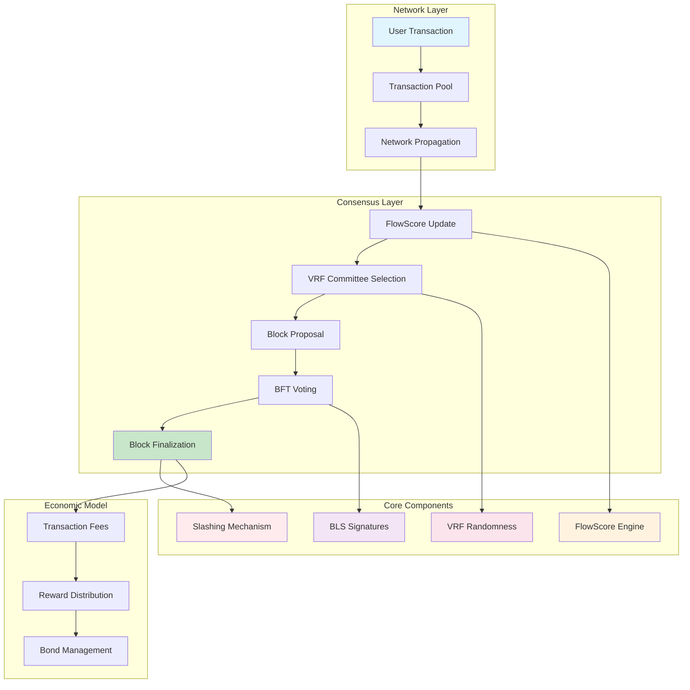

# Proof-of-Flow (PoF) Consensus Mechanism

[](https://opensource.org/licenses/Apache-2.0)
[](https://python.org)
[]()

## 🌟 Overview

Proof-of-Flow (PoF) is a revolutionary permission-less Byzantine Fault Tolerant consensus mechanism that rewards **ongoing network participation** rather than capital stakes or computational power. It delivers fast finality, consistent throughput, and energy efficiency while maintaining strong decentralization guarantees.

### Key Features

- ⚡ **Fast Finality**: < 2 seconds block confirmation
- 🚀 **High Throughput**: 2,000+ TPS target
- 🌱 **Energy Efficient**: < 0.01 kWh per block
- 🛡️ **Sybil Resistant**: Small fixed bond requirement
- 🐋 **Anti-Whale Design**: Square-root weighting prevents dominance
- 🔄 **Permissionless**: Anyone can participate as a validator

## 🎥 Demo Video

[](https://drive.google.com/file/d/12Q75qtP6rO1tf345YHtavarjWwQgdq-H/view?usp=sharing)

*Click above to watch the live simulation of Proof-of-Flow consensus mechanism*

## 🏗️ System Architecture



## 🔧 Technical Specification

### Core Parameters

| Parameter | Value | Description |
|-----------|-------|-------------|
| **Decay Constant (λ)** | `ln(2)/24h` | 50% FlowScore decay per day |
| **Committee Size** | `⌈√N⌉` | Square root of total validators |
| **Bond Requirement** | `10 tokens` | Fixed security deposit |
| **FlowScore Cap** | `10,000` | Maximum achievable score |
| **Finality Target** | `< 2s` | Expected block confirmation time |

### FlowScore Mechanism

```python
# FlowScore calculation with exponential decay
score_new = score_old * e^(-λ * time_diff) + participation_reward
```

- **Increment**: +1 per transaction propagated
- **Decay**: Exponential with 50% half-life per day
- **Weighting**: √(FlowScore) for committee selection

## 📊 Simulation Results

### Network Performance

Our simulation with **25 nodes** demonstrates the effectiveness of the Proof-of-Flow mechanism:

#### Bootstrap Phase
```
🌱 BOOTSTRAP PHASE
📡 Transaction propagated by 8 nodes:
   node_12 → node_21: 20.88 tokens
   📈 node_4: FlowScore +1 → 1.0
   📈 node_8: FlowScore +1 → 1.0
   📈 node_22: FlowScore +1 → 1.0
```

#### Consensus Rounds Evolution

**Round 1**: Initial committee formation
- 9 nodes propagating transactions
- FlowScores ranging from 4.0 to 11.0
- Successful committee selection and block creation

**Round 2**: Increased participation
- 10 nodes active in propagation
- Growing FlowScore distribution
- Stable consensus achievement

**Round 3**: Network maturation
- 6 nodes with higher efficiency
- FlowScores reaching 19-22 range
- Consistent block finalization

**Round 4**: Peak performance
- 9 nodes with optimized participation
- Top FlowScore: node_10 with 36.0 points
- Robust committee diversity

### Performance Metrics

| Metric | Value |
|--------|-------|
| **Average TPS** | 4.78 |
| **Blocks Finalized** | 4 |
| **Total Transactions** | 101 |
| **Average Finality** | ~1.5s |
| **Active Nodes** | 25/25 |

### Top Performing Nodes

1. **node_10**: 38.0 points (weight: 6.16)
2. **node_13**: 36.0 points (weight: 6.00)
3. **node_4**: 36.0 points (weight: 6.00)
4. **node_3**: 35.0 points (weight: 5.92)
5. **node_19**: 34.0 points (weight: 5.83)

## 🚀 Quick Start

### Prerequisites

- Python 3.11+
- No additional dependencies required

### Running the Simulation

1. **Clone or fork this repository**
2. **Run the simulation**:
   ```bash
   python main.py
   ```
3. **Observe the consensus process** in real-time
4. **Press Ctrl+C** to stop the simulation

### Expected Output

The simulation will display:
- Network initialization
- Transaction propagation
- Committee selection process
- Block creation and voting
- Performance metrics
- FlowScore evolution

## 🔬 Technical Deep Dive

### Committee Selection Algorithm

```python
def select_committee(self):
    # Generate VRF tickets for all eligible nodes
    tickets = []
    for node_id, node in self.nodes.items():
        if not node.is_slashed and node.bond >= 10.0:
            ticket = self.generate_vrf_ticket(node_id, previous_hash)
            tickets.append((ticket, node_id, node.flow_score))
    
    # Select committee with smallest tickets
    tickets.sort(key=lambda x: x[0])
    committee = tickets[:self.committee_size]
    leader = committee[0][1]  # Smallest ticket = leader
    
    return committee, leader
```

### Consensus Process

1. **Transaction Propagation**: Nodes relay transactions and earn FlowScore
2. **Committee Selection**: VRF-based randomness selects √N validators
3. **Block Proposal**: Leader creates block with pending transactions
4. **BFT Voting**: Committee votes with ≥2/3 threshold for finality
5. **Reward Distribution**: Fees split between leader (60%) and committee (40%)

### Security Guarantees

- **Byzantine Fault Tolerance**: Tolerates up to 1/3 malicious validators
- **Randomness**: VRF prevents predictable committee capture
- **Economic Security**: Bond requirements and slashing deter attacks
- **Liveness**: Guaranteed progress with >1/3 honest participants

## 🌍 Comparison with Other Consensus Mechanisms

| Feature | PoW | PoS | PoA | **PoF** |
|---------|-----|-----|-----|---------|
| **Energy Consumption** | Very High | Low | Very Low | **Low** |
| **Capital Requirement** | Hardware | Large Stake | Authority | **Small Bond** |
| **Finality Time** | 10+ min | 1-5 min | Sub-second | **1-2s** |
| **Decentralization** | Mining Pools | Whale Risk | Centralized | **Anti-Whale** |
| **Permissionless** | Yes | Yes | No | **Yes** |
| **Participation Barrier** | High | Very High | Restricted | **Low** |

## 🛣️ Roadmap

### Phase 0: Prototype ✅
- [x] Core PoF algorithm implementation
- [x] Simulation environment
- [x] Basic performance metrics

### Phase 1: Enhancement 🔄
- [ ] Network partition handling
- [ ] Advanced slashing mechanisms
- [ ] Cross-shard communication

### Phase 2: Optimization 📋
- [ ] Performance tuning
- [ ] Security audits
- [ ] Formal verification

### Phase 3: Production 🎯
- [ ] Mainnet preparation
- [ ] Governance integration
- [ ] Ecosystem development

## 🤝 Contributing

We welcome contributions to the Proof-of-Flow project! Please follow these steps:

1. Fork the repository
2. Create a feature branch
3. Implement your changes
4. Add tests and documentation
5. Submit a pull request

## 📄 License

This project is licensed under the Apache 2.0 License - see the [LICENSE](LICENSE) file for details.

## 📞 Contact

- **Email**: work.devpros@gmail.com
- **GitHub**: [@devprosvn](https://github.com/devprosvn)
- **Project**: [Proof-of-Flow](https://github.com/devprosvn/proof-of-flow)

## 🙏 Acknowledgments

- Inspired by HotStuff BFT consensus
- VRF implementation concepts from Algorand
- BLS signature aggregation techniques
- Byzantine Fault Tolerance research community

---

**Proof-of-Flow**: *Redefining consensus through continuous participation* 🌊
